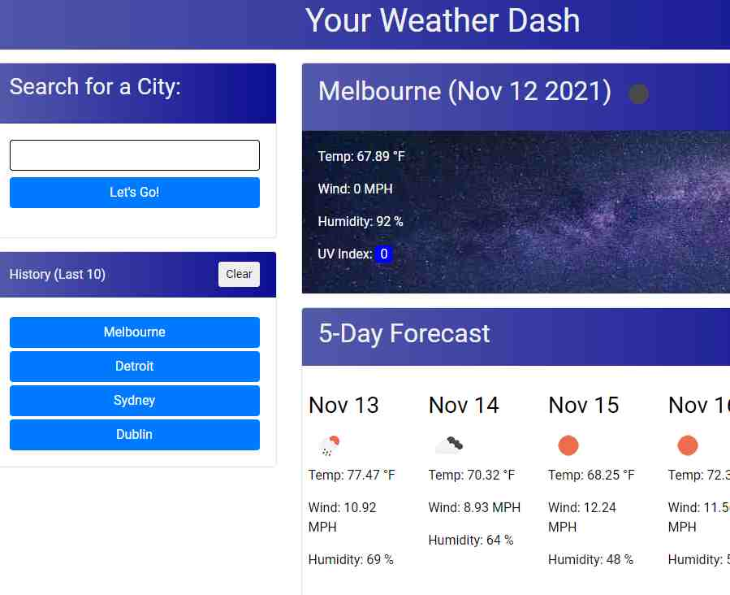

# Weather Dash

## Description

This is a weather dashboard built for Week 6 of the Vanderbilt Full-stack Coding Boot Camp, which uses the OpenWeather One Call API to retrieve weather data.

- Search for a city and be presented with current and future conditions.
- A search history of cities previously searched, stored in localStorage.
- Displays city name, date, and icon depicting weather conditions, the temperature, humidity, wind speed, and UV index.
- Color coding for favorable, moderate, or severe weather.
- Future weather conditions for a city present a 5-day forecast with dates, icons representing weather conditions, temperature, wind speed, and humidity.
- Cities in the search history can be clicked on to reload that data.

## Table of Contents

- [Installation](#installation)
- [Usage](#usage)
- [Credits](#credits)
- [License](#license)

## Installation

Clone the repository in a CLI using the command `git clone` to download all source files.

## Usage

Upload HTML source code and asset files to hosting service such as GitHub Pages.

The landing page is hosted [here](https://branjames117.github.io/weather-dash/).

## Credits

Developed by Brandon James Hoskins for the Vanderbilt Coding Boot Camp, 2021.

## License

Creative Commons Zero v1.0 Universal

API Key = 327c433da9985eb244da1437c2c3e4e5
